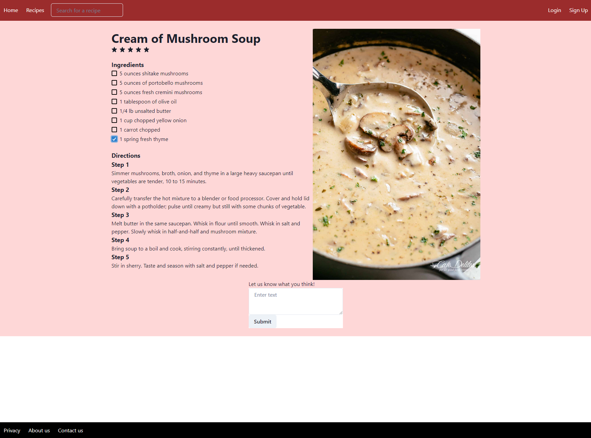

# CPSC 349 - Front End Web Development - Final Project

### Name: Anthony Cabacungan
### CWID: 8864845183
#
## Description

This project is a food recipe website demo that is written in JavaScript, React, and Chakra UI.

## Installation

This project was created using Create React App. Make sure you are in the root folder to use the following commands.

    npm i
Installs necessary dependencies (React components, Chakra library, and Chakra Icons)

    npm start
Runs the application and opens in http://localhost:3000

## Features

* Navigation bar and Footer bar without routing
* Body content that contains recipe, ingredients and picture
* Comment section without form submission

